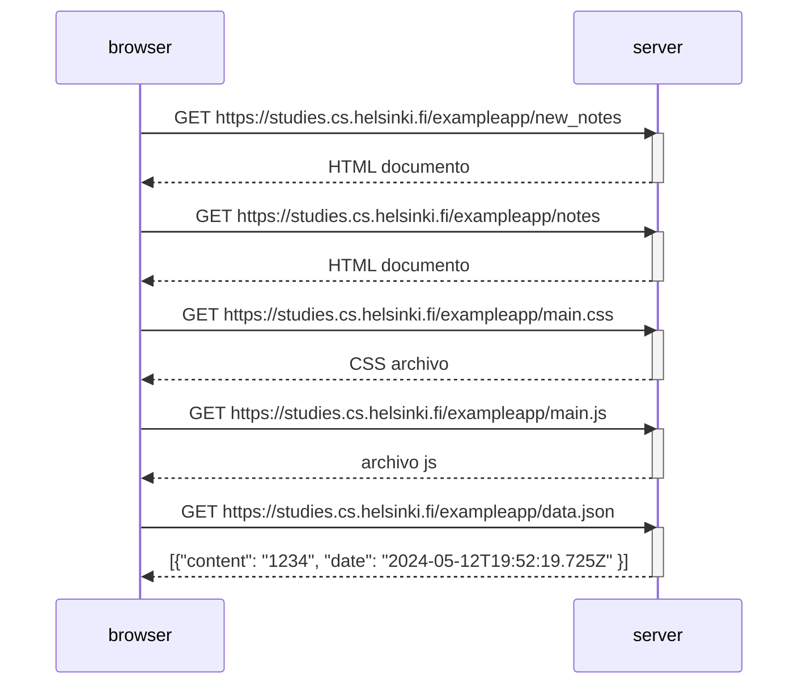

```mermaid
sequenceDiagram
    participant browser
    participant server
  
    browser->>server: GET https://studies.cs.helsinki.fi/exampleapp/new_notes
    activate server
    server-->>browser: HTML documento
    deactivate server
  
    browser->>server: GET https://studies.cs.helsinki.fi/exampleapp/notes
    activate server
    server-->>browser: HTML documento
    deactivate server

    browser->>server: GET https://studies.cs.helsinki.fi/exampleapp/main.css
    activate server
    server-->>browser: CSS archivo
    deactivate server
  
    browser->>server: GET https://studies.cs.helsinki.fi/exampleapp/main.js
    activate server
    server-->>browser: archivo js
    deactivate server
  
    browser->> server: GET https://studies.cs.helsinki.fi/exampleapp/data.json
    activate server
    server-->>browser: [{"content": "1234", "date": "2024-05-12T19:52:19.725Z" }]
    deactivate server
```
  
  
